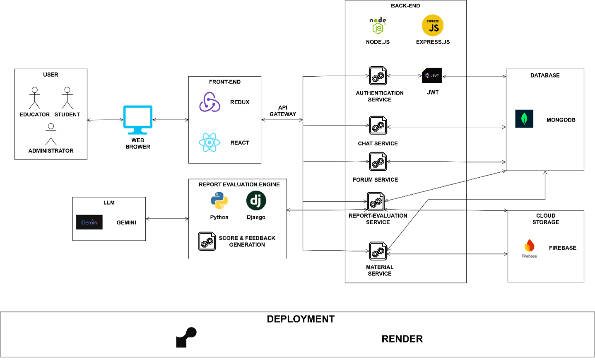
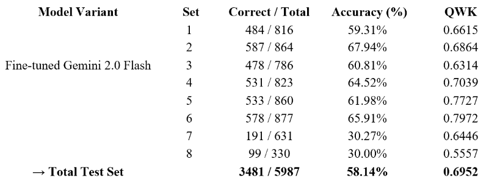

# SmartLMS: A Report-Based Evaluation Support System
A Capstone Graduation Project by the Faculty of Computer Science and Engineering, Ho Chi Minh City University of Technology (HCMUT).

---

## 🚀 Introduction

Traditional methods of grading student reports and essays are time-consuming, prone to bias, and often inconsistent. **SmartLMS** is a system designed to solve this problem by integrating a simple Learning Management System (LMS) platform with a powerful, automated evaluation engine.

The core of this project is a report-based evaluation system that utilizes Google's Gemini Large Language Model (LLM). This system provides accurate scoring and personalized feedback by analyzing student submissions against clear, pre-defined rubrics set by educators.

## 🔧 System Architecture


## 🧠 Dataset
* We get the data set in this link: [Dataset](https://www.kaggle.com/competitions/asap-aes)

## 👨‍🏫 Result
* Our best result is shown in the image below:


## Video demo
* You can watch our website via this link: [Video demonstration](https://youtu.be/LhpiTtmS75w)


## ✨ Key Features

The system provides distinct functionalities for three user roles:

### 👨‍🎓 For Students
* Secure login/logout.
* View a list of enrolled courses.
* Download course materials (lectures, documents).
* Submit assignments/reports.
* View grades and detailed feedback (including AI-generated suggestions).
* Real-time chat with other course members.

### 👨‍🏫 For Educators
* Manage their courses and upload learning materials.
* Create new assignments and upload description files and grading rubrics.
* View student submissions.
* Review AI-generated scores and feedback.
* **Adjust and override** the AI's score before publishing it to students.
* Chat with students and other educators.

### 🛠️ For Administrators
* Manage user accounts (create, update, delete students and educators).
* Create and manage courses within the system.
* Enroll or remove students/educators from a course.

## 🔧 Tech Stack

This project is built on a modern, microservice-oriented architecture:

| Component | Technology | Purpose |
| :--- | :--- | :--- |
| **Frontend** | React, Redux | User Interface (UI/UX) and client-side state management. |
| **Backend (Web)** | Node.js, Express.js | Main API handling, authentication, course management, and chat. |
| **Backend (AI)** | Python, Django | Serves the API for the AI-powered evaluation and grading service. |
| **Database** | MongoDB | Stores user data, courses, submissions, and grades. |
| **File Storage** | Firebase Cloud Storage | Stores course materials and student submission files. |
| **AI Model** | Google Gemini 2.0 Flash (Fine-tuned) | Powers the automated scoring and feedback generation. |
| **Deployment** | Render | Cloud platform for hosting the backend and frontend services. |

## 🧠 The Core AI Evaluation Engine

The highlight of the project is the automated scoring model.

**Model:** We fine-tuned Google's **Gemini 2.0 Flash** model.
**Data:** The model was trained on the **ASAP (Automated Essay Scoring) dataset** from Kaggle, which includes 8 different essay sets.
**Performance:** Our best-performing model (trained on 7000 samples, temp = 0.3) achieved a **Quadratic Weighted Kappa (QWK) score of 0.6952**.
**Result:** This QWK score indicates a high agreement with human raters and meets the "acceptable" threshold (often > 0.70) for automated scoring systems, validating its potential for practical application.

## 🏁 Getting Started

To run this project locally, you will need to set up all three components: the frontend, the web backend (Node.js), and the AI service (Python).

### 1. Backend (Web Service - Node.js)
Based on the `backend/routes` file structure:
```bash
# Navigate to the backend directory
cd backend

# Install dependencies
npm install

# Create a .env file and configure environment variables
# (MONGO_URI, JWT_SECRET, FIREBASE_CONFIG, etc.)
cp .env.example .env

# Run the server
npm start
```

### 2. Frontend (React)
Based on the frontend/src file structure:

```bash

# Navigate to the frontend directory
cd frontend

# Install dependencies
npm install

# Configure the API proxy in package.json or .env
# (VITE_API_URL=http://localhost:3000)

# Run the React app
npm start
```

### 3. Backend (AI Service - Python/Django)
Based on the API/aess file structure:

```bash

# Navigate to the AI service directory
cd API

# Create a virtual environment
python -m venv .venv
source .venv/bin/activate  # (or .\.venv\Scripts\activate on Windows)

# Install dependencies
pip install -r requirements.txt

# Create a .env file and configure your Google AI API Key
cp .env.example .env

# Run the Django server
python manage.py runserver
```
👥 Team members:

- Hoang Phan Ngoc Minh - 2053214 

- Le Hoang Duy - 2152040 

- Nguyen Minh Triet - 2153915 

👥 Supervisors:
- Assoc. Prof. Vo Thi Ngoc Chau 

- PhD. Nguyen Hua Phung